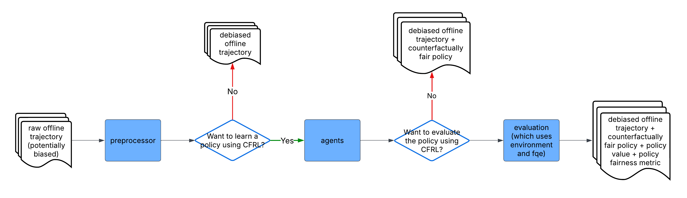

# CFRL: A Python Library for Counterfactually Fair Reinforcement Learning

Documentation: [CFRL Documentation](https://cfrl-documentation.netlify.app/).

Paper: To be updated. 

## Installation

```bash 
$ pip install cfrl
```

## A Brief Introduction to Counterfactual Fairness

Counterfactual fairness is one variation of fairness metrics. However, unlike well-known group 
fairness metrics such as demographic parity and equal opportunity, counterfactual fairness defines 
fairness based on causal reasoning and enforces it at the individual level. In short, a reinforcement learning policy is counterfactually fair if, at every time step, it would assign the same decisions 
with the same probabilities for an individual had the individual belong to a different subgroup 
defined by some sensitive attribute (such as race and gender). At its core, counterfactual fairness 
views the observed states and rewards as biased proxies of the (unobserved) true underlying states 
and rewards, where the bias is often a result of the observed sensitive attribute. Thus, to ensure 
counterfactual fairness, we want the policy to be based on the true underlying states and rewards 
rather than their biased proxies. 

We refer interested readers to [Kusner et al. (2017)](https://arxiv.org/abs/1703.06856) for a detailed discussion of counterfactual fairness in the single-stage predictions setting, and to 
[Wang et al. (2025)](https://arxiv.org/abs/2501.06366) for a detailed discussion of counterfactual 
fairness in the reinforcement learning setting.

## Key Functionalities

CFRL is designed with two main functionalities: 

1. Provide algorithms that enforce counterfactual fairness for reinforcement learning policies. 
The current version of CFRL implements the sequential data preprocessing algorithm proposed by
[Wang et al. (2025)](https://arxiv.org/abs/2501.06366) for offline reinforcement learning. The 
algorithm takes in an offline RL trajectory and outputs a preprocessed, bias-free trajectory. The 
preprocessed trajectory can then be passed to any existing offline reinforcement learning algorithms 
for training, and the learned policy should be approximately counterfactually fair. 

2. Provide a platform to evaluate RL policies based on counterfactual fairness. After passing in 
their policy and a trajectory dataset from the target environment, users can assess how well their 
policies perform in the target environment in terms of the discounted cumulative reward and 
counterfactual fairness metric.

## High-level Design
| Module         | Functionalities                                                                                                                                                                                                                                                                                                |
|------------|------------------------------------------------------------|
| `reader`       | Implements functions that read tabular trajectory data from either a `.csv` file or a `pandas.Dataframe` into a format required by `CFRL`. Also implements functions that export trajectory data to either a `.csv` file or a `pandas.Dataframe`.                                                                                               |
| `preprocessor` | Implements the data preprocessing algorithm introduced in Wang et al. (2025).                                                                                                                                                                                                                                  |
| `agents`       | Implements a fitted Q-iteration (FQI) algorithm, which learns RL policies and makes decisions based on the learned policy. Users can also pass a preprocessor to the FQI; in this case, the FQI will be able to take in unpreprocessed trajectories and directly output counterfactually fair policies.        |
| `environment`  | Implements a synthetic environment that produces synthetic data as well as a simulated environment that simulates the transition dynamics of the environment underlying some real-world RL trajectory data. Also implements functions for sampling trajectories from the synthetic and simulated environments. |                                                                                                                                                                                  |
| `evaluation`   | Implements functions that evaluate the value and counterfactual fairness of a trained policy. Depending on the user's needs, the evaluation can be done either in a synthetic environment or in a simulated environment.                                                                                                      |



A general CFRL workflow is as follows: First, simulate a trajectory using `environment` or read in a trajectory using `reader`. Then, train a preprocessor using `preprocessor` to remove the bias in the trajectory data. After that, pass the preprocessed trajectory into the FQI algorithm in `agents` to learn a counterfactually fair policy. Finally, use functions in `evaluation` to evaluate the value and counterfactual fairness of the trained policy. See ... for more detailed workflow examples.

## Examples

We provide a few short code examples showcasing some key use cases of CFRL.

**1. Trajectory Preprocessing Only:** See [here](https://github.com/JianhanZhang/CFRL/blob/main/examples/preprocessing_only_workflow.ipynb).

**2. Policy Learning Only:** See [here](https://github.com/JianhanZhang/CFRL/blob/main/examples/policy_learning_only_workflow.ipynb).

**3. Assessing Preprocessors using Synthetic Data:** See [here](https://github.com/JianhanZhang/CFRL/blob/main/examples/synthetic_data_workflow.ipynb).

**4. Assessing Policies using Real Data:** See [here](https://github.com/JianhanZhang/CFRL/blob/main/examples/real_data_workflow.ipynb).

## Testing
We provide unit tests as well as integration tests for the main functions of the CFRL. The tests can be 
found in the `tests` folder of the `CFRL` repository. To run the test, first install `pytest`: 

```bash 
$ pip install pytest
```

Then run 

```bash 
$ python -m pytest
```

Note that this library relies heavily on machine learning and deep learning methods such as neural 
networks. The outputs from these methods are not exactly predictable because of the stochasticity 
involved. Therefore, most of the tests focus on testing the shape and data type of the outputs rather 
than the value of the outputs.

*Note: Currently, the 'lm' model type is not supported. Thus, `pytest` will skip the test cases that involve the 'lm' model type.*