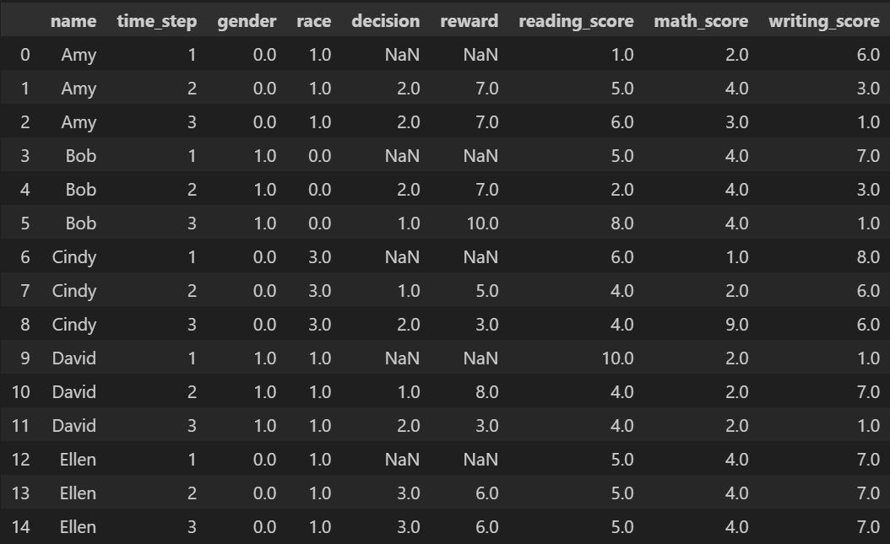

.. _tabular_trajectory_data:

Tabular Trajectory Data
================================

As long as the offline trajectory data satisfies the :ref:`data requirements <data_requirements>`, it 
can be passed into CFRL. The trajectory inputs and outputs of CFRL functions and classes are in the 
format of :ref:`Trajectory Arrays <trajectory_arrays>`. However, in the real world, the trajectory 
data is often stored in a tabular format rather than in Trajectory Arrays. To address this, the 
:code:`reader` module provides the :code:`read_trajectory_from_csv()` and 
:code:`read_trajectory_from_dataframe()` functions for converting tabular trajectory data to 
Trajectory Arrays, as well as the :code:`convert_trajectory_to_dataframe()` and 
:code:`export_trajectory_to_csv()` functions for converting Trajectory Arrays to the tabular format. 
These function all work with tabular data of a particular format, which we introduce in this section.

For some individual :math:`i`, let the observed sensitive attribute be :math:`z_i`. 
At time :math:`t`, we denote the set of transition experienced by this individual by 
:math:`x_{it}, a_{it}, x_{i,t+1}, r_{it}`. For example, at :math:`t=0`, individual :math:`i` could 
start with some initial state :math:`x_{i0}`. The individual then takes action :math:`a_{i0}`, and 
the environment transitions to a state :math:`x_{i1}` and produces a reward :math:`r_{i0}`. Now, 
at :math:`t=1`, the individual takes action :math:`a_{i1}`, and the environment transitions to 
:math:`x_{i2}` and produces :math:`r_{i1}`, and so on. Given this notation, the tabular trajectory 
data need to be in the following format: 

1. The table includes columns that represent the observed sensitive attribute, the state, the action,  
   the reward, and the ID (which should be univariate), respectively, of the individuals in the 
   trajectory data. If the sensitive attribute or state is multivariate, then each component should be in 
   a separate column. The table might also include columns that belong to none of the categories above, 
   which will not be read into Trajectory Arrays. 

2. Each column should have a unique name.

3. Each row contains the observed sensitive attribute, the current state, the previous action (which 
   resulted in the current state), the current reward, and the ID of a single individual (uniquely 
   identified by the ID) at a single time step. That is, it contains :math:`z_i`, :math:`x_{it}`, 
   :math:`a_{i,t-1}`, :math:`r_{i, t-1}`, and the ID for some individual :math:`i` and time step :math:`t`.

4. The rows of each individual should be grouped together in ascending order according to the time 
   step. That is, suppose individual :math:`i` has 3 time steps (:math:`t=0,1,2`). If row 10 represents 
   individual :math:`i` at :math:`t=0`, then row 11 should represent individual :math:`i` at :math:`t=1`, 
   and row 12 should represent individual :math:`i` at :math:`t=2`.

5. Each individual in the data set might have a different number of time steps. However, only the first 
   :math:`T` transitions will be read for each individual, where the number :math:`T` can be specified in 
   the arguments to :code:`read_trajectory_from_csv()` and :code:`read_trajectory_from_dataframe()`. Note 
   that each transition refers to the quartet :math:`x_{it}, a_{it}, x_{i,t+1}, r_{it}`.

For example, consider a trajectory dataset with three individuals where each individual has three time 
steps (i.e. two transitions). Then the corresponding tabular data should be organized in the format in 
the table below (entries marked with "ANY") can contain any contents.

+----+---------------+---------------+------------------+------------------+----------------+----------------+----------------+
| ID | Sens. Attr. 1 | Sens. Attr. 2 | State 1          | State 2          | Action         | Reward         | Something Else |
+====+===============+===============+==================+==================+================+================+================+
| 1  | :math:`z_1^1` | :math:`z_1^2` | :math:`x_{10}^1` | :math:`x_{10}^2` | ANY            | ANY            | ANY            |
+----+---------------+---------------+------------------+------------------+----------------+----------------+----------------+
| 1  | :math:`z_1^1` | :math:`z_1^2` | :math:`x_{11}^1` | :math:`x_{11}^2` | :math:`a_{10}` | :math:`r_{10}` | ANY            |
+----+---------------+---------------+------------------+------------------+----------------+----------------+----------------+
| 1  | :math:`z_1^1` | :math:`z_1^2` | :math:`x_{12}^1` | :math:`x_{12}^2` | :math:`a_{11}` | :math:`r_{11}` | ANY            |
+----+---------------+---------------+------------------+------------------+----------------+----------------+----------------+
| 2  | :math:`z_2^1` | :math:`z_2^2` | :math:`x_{20}^1` | :math:`x_{20}^2` | ANY            | ANY            | ANY            |
+----+---------------+---------------+------------------+------------------+----------------+----------------+----------------+
| 2  | :math:`z_2^1` | :math:`z_2^2` | :math:`x_{21}^1` | :math:`x_{21}^2` | :math:`a_{20}` | :math:`r_{20}` | ANY            |
+----+---------------+---------------+------------------+------------------+----------------+----------------+----------------+
| 2  | :math:`z_2^1` | :math:`z_2^2` | :math:`x_{22}^1` | :math:`x_{22}^2` | :math:`a_{21}` | :math:`r_{21}` | ANY            |
+----+---------------+---------------+------------------+------------------+----------------+----------------+----------------+
| 3  | :math:`z_3^1` | :math:`z_3^2` | :math:`x_{30}^1` | :math:`x_{30}^2` | ANY            | ANY            | ANY            |
+----+---------------+---------------+------------------+------------------+----------------+----------------+----------------+
| 3  | :math:`z_3^1` | :math:`z_3^2` | :math:`x_{31}^1` | :math:`x_{31}^2` | :math:`a_{30}` | :math:`r_{30}` | ANY            |
+----+---------------+---------------+------------------+------------------+----------------+----------------+----------------+
| 3  | :math:`z_3^1` | :math:`z_3^2` | :math:`x_{32}^1` | :math:`x_{32}^2` | :math:`a_{31}` | :math:`r_{31}` | ANY            |
+----+---------------+---------------+------------------+------------------+----------------+----------------+----------------+

For another example, consider the :code:`.csv` file containing the trajectory data shown below.

.. image:: ../supps/sample_tabular_input.png

We then run

.. code:: python

    zs, states, actions, rewards, ids = read_trajectory_from_csv(
                                                path='./sample_input.csv', 
                                                z_labels=['gender', 'race'], 
                                                state_labels=['reading_score', 
                                                              'math_score', 
                                                              'writing_score'], 
                                                action_label='decision', 
                                                reward_label='reward', 
                                                id_label='name', 
                                                T=2
                                                )

The output Trajectory Arrays are

.. code:: 

    zs = np.array([[0., 1.], [1., 0.], [0., 3.], [1., 1.], [0., 1.]])

    states = np.array([[[ 1., 2., 6.], [5., 4., 3.], [6., 3., 1.]], 
                       [[ 5., 4., 7.], [2., 4., 3.], [8., 4., 1.]], 
                       [[ 6., 1., 8.], [4., 2., 6.], [4., 9., 6.]],
                       [[10., 2., 1.], [4., 2., 7.], [4., 2., 1.]],
                       [[ 5., 4., 7.], [5., 4., 7.], [5., 4., 7.]]])

    actions = np.array([[2., 2.], [2., 1.], [1., 2.], [1., 2.], [3., 3.]])

    rewards = np.array([[7., 7.], [7., 10.], [5., 3.], [8., 3.], [6., 6.]])

    ids = array([['Amy'], ['Bob'], ['Cindy'], ['David'], ['Ellen']], dtype=object)

We can also convert the Trajectory Arrays back to the tabular format by running 

.. code:: python

    tabular_trajectory = convert_trajectory_to_dataframe(
                                                     zs=zs, 
                                                     states=states, 
                                                     actions=actions, 
                                                     rewards=rewards, 
                                                     ids=ids, 
                                                     z_labels=['gender', 'race'], 
                                                     state_labels=['reading_score', 
                                                                   'math_score', 
                                                                   'writing_score'], 
                                                     action_label='decision', 
                                                     reward_label='reward', 
                                                     id_label='name', 
                                                     T_label='time_step'
                                                     )

The output :code:`tabular_trajectory` is 

Note that the output tabular trajectory also includes a column recording the time step. The time 
steps in the column start from 1.