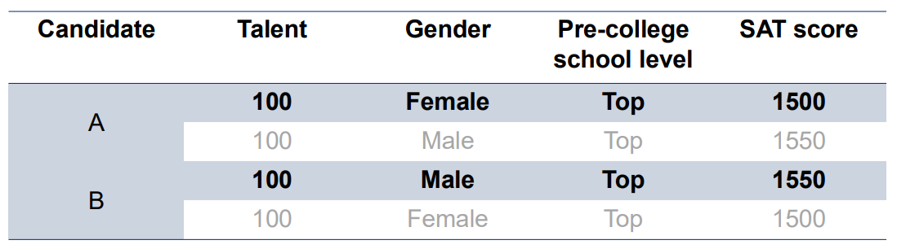

Getting Started
===========================

Installation
---------------------------

.. code:: bash

    $ pip install cfrl

A Brief Introduction to Counterfactual Fairness
-------------------------------------------------

Counterfactual fairness is one variation of fairness metrics. However, unlike well-known group 
fairness metrics such as demographic parity and equal opportunity, counterfactual fairness defines 
fairness based on causal reasoning and enforces it at the individual level. In short, a reinforcement 
learning policy is counterfactually fair if, at every time step, it would assign the same decisions 
with the same probabilities for an individual had the individual belong to a different subgroup 
defined by some sensitive attribute (such as race and gender). At its core, counterfactual fairness 
views the observed states and rewards as biased proxies of the (unobserved) true underlying states 
and rewards, where the bias is often a result of the observed sensitive attribute. Thus, to ensure 
counterfactual fairness, we want the policy to be based on the true underlying states and rewards 
rather than their biased proxies. 

Below, we provide an example to illustrate the intuition behind counterfactual fairness in the 
single-stage seting. We refer interested readers to 
`Kusner et al. (2017) <https://arxiv.org/abs/1703.06856>`_ for a detailed 
discussion of counterfactual fairness in the single-stage predictions setting, and to 
`Wang et al. (2025) <https://arxiv.org/abs/2501.06366>`_ for a detailed discussion of counterfactual 
fairness in the reinforcement learning setting.

Example: College Admissions
~~~~~~~~~~~~~~~~~~~~~~~~~~~~~~~~~~

Two candidates, A (female) and B (male), are applying for admission to a college. 
As shown in the table, A and B have the 
same level of talent and would have achieved the same SAT score had they been both female or 
both male. However, in reality, A achieved a lower SAT score than B due to structural 
discrimination faced by women in her community. 

Suppose the college wants to select candidates with the highest talent. 
Since talent is unobserved, the college can only make decisions using observed 
metrics (i.e. the SAT score and pre-college school level). If the decision-making is 
fairness-blind, then it will prefer B over A because B has a higher SAT score. However, 
one can argue that this is unfair because A's lower score is a result of discrimination 
rather than her lack of talent. Indeed, this does not satisfy counterfactual fairness 
because, for example, had A been a male, then her SAT score would have been the same 
as B's, and the college will see A and B as equally talented. On the other hand, 
the algorithm in Wang et al. (2025) requires 
the college to estimate B's SAT score had he been a female and A's SAT score had 
she been a male. If these estimates are accurate, then for both A and B we would 
observe a vector :math:`[1500, 1550]` of counterfactual SAT scores, and then the college would see 
that both candidates should be equally talented because their SAT scores would be the same 
had both of them been female or both of them been male. This is counterfactually fair.

This example also highlights two key differences between counterfactual fairness and 
equal opportunity (or demographic parity): First, the former defines fairness at the 
individual-level, while the latter defines fairness at the group-level. Second, the former 
defines fairness using causal reasoning, while the latter defines fairness by checking 
statistical associations and parities. 

Key Functionalities
-------------------------

CFRL is designed with two main functionalities: 

1. Provide algorithms that enforce counterfactual fairness for reinforcement learning policies. 
The current version of CFRL implements the sequential data preprocessing algorithm proposed by
`Wang et al. (2025) <https://arxiv.org/abs/2501.06366>`_ for offline reinforcement learning. The 
algorithm takes in an offline RL trajectory and outputs a preprocessed, bias-free trajectory. The 
preprocessed trajectory can then be passed to any existing offline reinforcement learning algorithms 
for training, and the learned policy should be approximately counterfactually fair. 

2. Provide a platform to evaluate RL policies based on counterfactual fairness. After passing in 
their policy and a trajectory dataset from the target environment, users can assess how well their 
policies perform in the target environment in terms of the discounted cumulative reward and 
counterfactual fairness metric.

High-level Design
-------------------------

.. list-table:: 
   :header-rows: 1
   :widths: 15 85

   * - Module
     - Functionalities
   * - :code:`reader`
     - Implements functions that read tabular trajectory data from either a :code:`.csv` file or a :code:`pandas.DataFrame` into a format required by :code:`CFRL` (:ref:`Trajectory Arrays <trajectory_arrays>`). Also implements functions that export trajectory data to either a :code:`.csv` file or a :code:`pandas.DataFrame`.
   * - :code:`preprocessor`
     - Implements the data preprocessing algorithm introduced in Wang et al. (2025).
   * - :code:`agents`
     - Implements a fitted Q-iteration (FQI) algorithm, which learns RL policies and makes decisions based on the learned policy. Users can also pass a preprocessor to the FQI; in this case, the FQI will be able to take in unpreprocessed trajectories, internally preprocess the input trajectories, and directly output counterfactually fair policies.
   * - :code:`environment`
     - Implements a synthetic environment that produces synthetic data as well as a simulated environment that simulates the transition dynamics of the environment underlying some real-world RL trajectory data. Also implements functions for sampling trajectories from the synthetic and simulated environments.
   * - :code:`evaluation`
     - Implements functions that evaluate the value and counterfactual fairness of a policy. Depending on the user's needs, the evaluation can be done either in a synthetic environment or in a simulated environment.

.. image:: ../supps/workflow_chart_cropped.png

A general CFRL workflow is as follows: First, simulate a trajectory using :code:`environment` or read 
in a trajectory using :code:`reader`. Then, train a preprocessor using :code:`preprocessor` to remove 
the bias in the trajectory data. After that, pass the preprocessed trajectory into the FQI algorithm in 
:code:`agents` to learn a counterfactually fair policy. Finally, use functions in :code:`evaluation` to 
evaluate the value and counterfactual fairness of the trained policy. See the 
:ref:`"Example Workflows" <example_workflows>` section for more detailed workflow examples.