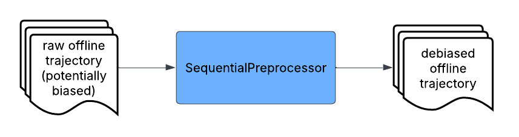
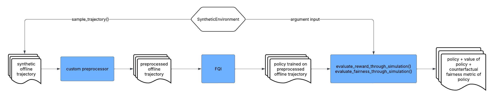
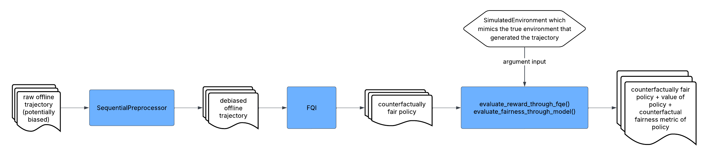

Example Workflows
===============================

This section demonstrates some major workflows that can be performed by CFRL.

Preprocessing Only
--------------------------

In this workflow, CFRL takes in an offline trajectory and then preprocesses the offline trajectory 
using :code:`SyntheticPreprocessor`. The final output of the workflow is the preprocessed (debiased) 
offline trajectory. This workflow is appropriate when the user does not want to train policies using 
CFRL. Instead, the user can take the preprocessed trajectory to train a counterfactually fair policy 
using another reinforcement learning library or application that better fits their needs.

**Code:** A detailed code demonstration of this workflow can be found 
`here <https://github.com/JianhanZhang/CFRL/blob/main/examples/preprocessing_only_workflow.ipynb>`_.

Policy Learning Only
--------------------------

.. image:: ../supps/policy_learning_only_workflow.png

In this workflow, CFRL takes in an offline trajectory and then preprocesses the offline trajectory 
using :code:`SequentialPreprocessor`. After that, the preprocessed trajectory is passed into 
:code:`FQI` to train a counterfactually fair policy, which is the final output of the workflow. This 
workflow is appropriate if the user wants to train a policy using CFRL. The trained policy can be 
further evaluated on its value and counterfactual fairness, which is discussed in detail in the 
"Assessing Policies Using Real Data" workflow later in this section.

**Code:**: A detailed code demonstration of this workflow can be found 
`here <https://github.com/JianhanZhang/CFRL/blob/main/examples/policy_learning_only_workflow.ipynb>`_.

Assessing Preprocessors Using Synthetic Data
--------------------------

In this workflow, CFRL first uses :code:`sample_trajectory()` to sample a trajectory from a 
:code:`SyntheticEnvironment` whose transition rules are pre-specified. It then preprocesses the 
sampled trajectory using some :ref:`custom preprocessor <custom_preprocessors>` defined by the user. 
After that, the preprocessed trajectory is passed into :code:`FQI` to train a policy, which is then 
assessed using synthetic data via :code:`evaluate_reward_through_simulation()` and 
:code:`evaluate_fairness_through_simulation()`. The final output of the workflow is the policy trained 
on the preprocessed data as well as its estimated value and counterfactual fairness metric. This 
workflow is appropriate when the user wants to examine the impact of some trajectory preprocessing 
method on the value and counterfactual fairness of the trained policy.

**Code:**: A detailed code demonstration of this workflow can be found 
`here <https://github.com/JianhanZhang/CFRL/blob/main/examples/synthetic_data_workflow.ipynb>`_.

Assessing Policies Using Real Data
--------------------------

In this workflow, CFRL takes in an offline trajectory and then preprocesses the offline trajectory 
using :code:`SequentialPreprocessor`. After that, the preprocessed trajectory is passed into 
:code:`FQI` to train a counterfactually fair policy, which is then assessed using 
:code:`evaluate_reward_through_fqe()` and :code:`evaluate_fairness_through_model()` based on a 
:code:`SimulatedEnvironment` that mimics the transition rules of the true environment underlying the 
training trajectory. The final output of the workflow is the policy trained on the preprocessed data 
as well as its estimated value and counterfactual fairness metric. This workflow is appropriate when the 
user is interested in knowing the value and counterfactual fairness achieved by the trained policy when 
interacting with the true underlying environment.

**Code:** A detailed code demonstration of this workflow can be found 
`here <https://github.com/JianhanZhang/CFRL/blob/main/examples/real_data_workflow.ipynb>`_.

**Conceptual Explanation:** A step-by-step conceptual explanation of this workflow can be found 
`here <https://github.com/JianhanZhang/CFRL/blob/main/examples/real_data_workflow_description.pdf>`_.